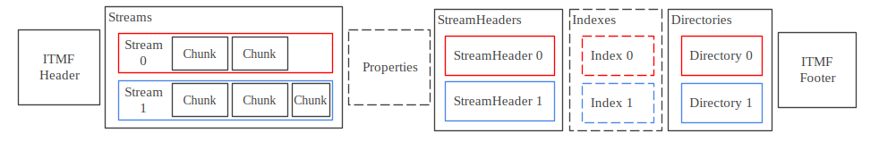
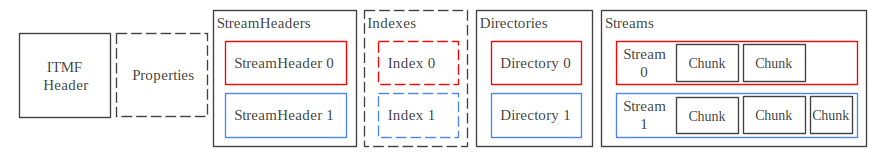

# libitmf Architecture  
This page serves as a top-to-bottom introduction to both the architecture of libitmf and the key ideas of the ITMF Container. The page is up-to-date with version 1.0 of the ITMF Container Specification.  

This does not cover every single detail about the ITMF Container. For more information, refer to the [ITMF Specification](https://www.immersivealliance.org/download/download-itmf/).  

## Contents

* [ITMF File](#itmf-file)  
* [Logical Units](#logical-units)  
  * [Header](#header)  
  * [Streams and Chunks](#streams-and-chunks)  
  * [Properties](#properties)  
  * [StreamHeaders](#streamheaders)  
  * [Indexes](#indexes)  
  * [Directories](#directories)  
  * [Footer](#footer)  
* [BML Types](#bml-types)  
* [VUIE and VSIE: Variable-Length Types](#vuie-and-vsie-variable-length-types)  

## ITMF File  

At the highest level, libitmf is a library focused on interacting with ITMF files (usually denoted by the `.itmf` extension). The outermost layer of an ITMF file is the Container, a binary markup language (BML) format that implements a virtual disk system with metadata support.   

In libitmf, ITMF files are represented by the ITMFFILE class. Under the C++ API, files can be read in from the filesystem by specifying a path:  

```
#include "itmffile.h"

int main() {
    itmf::ITMFFILE file = itmf::ITMFFILE::ReadFile("C:\\Users\\austin\\cablelabs\\development\\test_data\\octanetest.itmf");
}
```

The ITMF Container is composed of an ordered sequence of structured sections known as logical units. More detail on the specifics of each logical unit in a moment. There are two valid orderings of the logical units, termed “Streams at Start” and “Streams at End”. Here is what each one looks like:  

  
  

Dashed lines indicate an optional unit. StreamHeaders, Indexes, Directories, and Streams all may contain one or more of their corresponding sub-unit.  

Note that, for compatibility with legacy versions of OTOY’s ORBX format that ITMF was based on, the Properties unit may appear immediately after the Header in Streams at Start.  

When creating a new ITMF file from scratch, the file may be initialized with the desired ordering using one of the following functions:  

`itmf::ITMFFILE file = itmf::ITMFFILE::CreateStreamsAtStartFile();`  
`itmf::ITMFFILE file = itmf::ITMFFILE::CreateStreamsAtEndFile();`  

A file may also be initialized from an ITMFCONFIGURATION object, which stores information that corresponds to metadata from the ITMF Header. For example:  

```
itmf::ITMFCONFIGURATION config(
itmf::ITMF_ENCODING_ORDER::STREAMS_AT_START, 
true, // Will the Properties logical unit be included?
true, // Will the Indexes logical unit be included? 
itmf::ITMF_SIGNATURE::NONE, 
itmf::ITMF_COMPRESSION::NONE);
   itmf::ITMFFILE file = itmf::ITMFFILE::CreateFileFromConfig(config);
```  

## Logical Units  

Each logical unit is made up of a sequence of data elements, some of which may be optional or repeated.   

### Header  
`class ITMF_HEADER`  
The header appears at the start of every ITMF file. It contains the container version, various flags including an indicator about whether the file is Streams at Start or Streams at End, and metadata related to encryption and compression if in use.  

### Streams and Chunks  
`class CHUNK`  
`typedef std::vector<CHUNK> CHUNKS`  
The Streams logical unit is composed of one or more Chunk logical units. Each chunk is a block of data associated with a particular stream, which is some ordered sequence of data stored in the file.   

### Properties  
`class PROPERTIES`  
Properties is a set of arbitrary key-value pairs, where keys are BML strings and values may be BML strings or longs.   

### StreamHeaders  
`class STREAM_HEADER`  
`typedef std::vector<STREAM_HEADER> STREAMHEADERS`  
StreamHeaders contains descriptions of each stream stored in the ITMF file. The description includes the length of the stream in chunks and bytes, the codec type, flags, and arbitrary key-value metadata associated with the stream.  

### Indexes  
`class INDEX`  
`typedef std::vector<INDEX> INDEXES`  
Each stream may be associated with an Index unit that facilitates fast random access into the stream by pointing to the location of each chunk in the stream.   

### Directories  
`class DIRECTORY`  
`class FILE_PROPERTIES`  
`typedef std::vector<DIRECTORY> DIRECTORIES`  
Each stream may be associated with a Directory unit which provides a list of files stored in the stream, the files’ locations and lengths, and arbitrary key-value metadata associated with the file.

In libitmf, a FILE_PROPERTIES class is used to store the description of each file in a DIRECTORY.

### Footer  
`class ITMF_HEADER`
The footer marks the end of the ITMF file. Note that it only appears in Streams at Start files.

## BML Types  
As mentioned above, each logical unit is composed of multiple BML elements, some of which may be optional or repeated. Each element begins with a tag, which is composed of a 3-bit long type and an ID that identifies which logical unit field is being read. Elements may be one of the following types:

| **Name** | **Type** | **Description**                                                                                                                                   | **libitmf class**                          |
|----------|----------|---------------------------------------------------------------------------------------------------------------------------------------------------|--------------------------------------------|
| close    | 0        | Closes a BML object element.                                                                                                                      | N/A (Checked when parsing) |
| object   | 1        | Starts a BML object element.                                                                                                                      | `BMLobject`                                |
| integer  | 2        | Signed integer up to 32 bits. The value is encoded with VSIE.                                                                                     | `BMLint`                                   |
| long     | 3        | Signed integer up to 64 bits. The value is encoded with VSIE.                                                                                     | `BMLlong`                                  |
| single   | 4        | Single precision (fp32) IEEE754 float, stored in little endian.                                                                                   | `BMLsingle`                                |
| double   | 5        | Double precision (fp64) IEEE754 float, stored in little endian.                                                                                   | `BMLdouble`                                |
| string   | 6        | A sequence of characters encoded first as length in bytes using VUIE, followed by the utf8-encoded bytes of the sequence (without trailing 0x00). | `BMLstring`                                |
| blob     | 7        | An arbitrary binary object (blob) encoded first as length in bytes using VUIE, followed by the bytes of the blob.                                 | `BMLblob`                                  |

### VUIE and VSIE: Variable-Length Types
As mentioned above, some of the BML elements leverage encodings known as VUIE, variable unsigned integer encoding, and VSIE, variable signed integer encoding. Each encoding may be up to 9 bytes long, where the number of leading ones indicates the number of subsequent bytes included in the encoded value. This means that both encodings support values up to 8 bytes long. In libitmf, VSIE and VUIE are both stored using the `BMLBitVector` class. 
